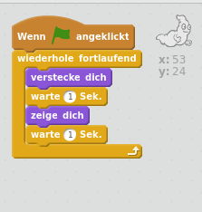

## Was du brauchen wirst

\--- task \---

Öffne ein neues Scratch-Projekt.

[[[generic-scratch-new-project]]]

\--- /task \---

\--- task \---

Füge eine neue Geister-Figur und einen passenden Bühnenhintergrund hinzu.

[[[generic-scratch-sprite-from-library]]]

[[[generic-scratch-backdrop-from-library]]]

\--- /task \---

\--- task \---

Füge deinem Geist Code hinzu, so dass er sich fortlaufend zeigt und wieder versteckt, nachdem du auf die grüne Flagge geklickt hast.

\--- hints \--- \--- hint \--- Once the `green flag is clicked`{:class=”blockevents”}, you'll need to make your ghost `hide`{:class=”blocklooks”} for `one second`{:class=”blockcontrol”} and then `show`{:class=”blocklooks”} for `one second`{:class=”blockcontrol”}. It will need to do this `forever`{:class=”blockcontrol”}. \--- /hint \--- \--- hint \--- Here are the code blocks you'll need:  \--- /hint \--- \--- hint \--- This is what your code should look like:  \--- /hint \--- \--- /hints \---

\--- /task \---

\--- task \---

Test and save your project.

[[[generic-scratch-saving]]]

\--- /task \---