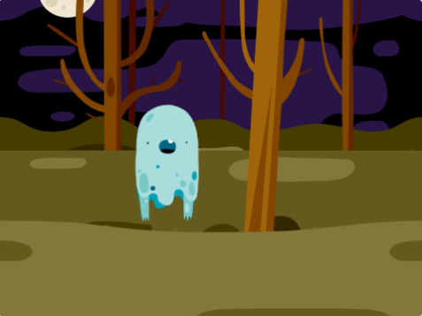
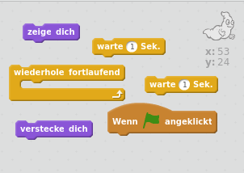

## Ein Gespenst lebendig werden lassen

\--- task \---

Öffne ein neues Scratch-Projekt.

[[[generic-scratch-new-project]]]

\--- /task \---

\--- task \---

Wähle eine neue Gespenster-Figur und einen passenden Bühnenhintergrund aus.

[[[generic-scratch-sprite-from-library]]]

[[[generic-scratch-backdrop-from-library]]]

\--- /task \---

\--- task \---

Füge für dein Gespenst Code zusammen, so dass es sich fortlaufend zeigt und wieder versteckt, nachdem du auf die grüne Flagge geklickt hast.

\--- hints \--- \--- hint \--- Wenn auf die `grüne Flagge geklickt wird`{:class=”blockevents”}, musst du erreichen dass sich dein Gespenst `eine Sekunde`{:class=”blockcontrol”} lang `versteckt`{:class=”blocklooks”} und dann `eine Sekunde`{:class=”blockcontrol”} lang `zeigt`{:class=”blocklooks”}. Das muss es `fortlaufend`{:class=”blockcontrol”} wiederholen. \--- /hint \--- \--- hint \--- Hier sind die Code-Blöcke, die du brauchen wirst:  \--- /hint \--- \--- hint \--- So sollte dein Code aussehen:  \--- /hint \--- \--- /hints \---

\--- /task \---

\--- task \---

Teste und speichere nun dein Projekt.

[[[generic-scratch-saving]]]

\--- /task \---