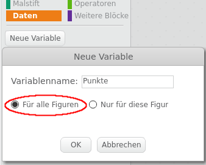
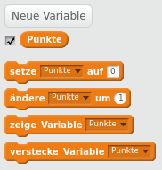

## Einen Punktestand hinzufügen

Es wird noch spannender, wenn Du einen Punktestand hinzufügst!

+ Um den Punktestand eines Spielers anzuzeigen, benötigst Du einen Bereich, wo dieser eingetragen werden kann. Eine __Variable__ ist solch eine Stelle, an der Daten gespeichert werden können, die sich eventuell verändern können. Wie zum Beispiel ein Punktestand.

	Um eine neue Variable zu erstellen, klicke auf den Skripte-Reiter, wähle `Daten` {.blockdata} aus und klicke auf 'Neue Variable'.

	

	Gib 'Punktestand' als den Variablennamen ein. Setze den Haken bei Für alle Figuren', damit die Punktestand-Variable für alle Figuren verfügbar ist, und klicke auf 'OK', um die Variable zu erstellen.
  Du wirst nun eine Menge Code-Blöcke sehen, die mit der Variable `Punktestand` {.blockdata} verfügbar sind.

	

	Den Punktestand siehst Du oben links in der Bühne.

	

+ Sobald ein neues Spiel startet (mit einem Klick auf die Fahne), solltest Du den Punktestand automatisch auf 0 setzen:

	```blocks
	Wenn die grüne Flagge angeklickt
	setze [Punktestand v] auf [0]
	```

+ Immer wenn ein Gespenst gefangen worden ist, ändere den Punktestand um 1:

	

+ Lasse das Programm noch einmal laufen und fange selbst einige Gespenster. Steigt Dein Punktestand?
