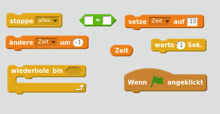
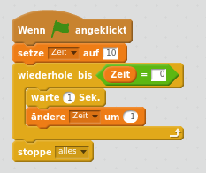

## Hinzufügen eines Timers

\--- task \---

Erstelle eine neue Variable und nenne sie "Zeit".

\--- /task \---

\--- task \---

Kannst du deiner Bühne einen Timer hinzufügen, so dass dein Spieler nur 10 Sekunden hat, um so viele Geister wie möglich zu fangen?

Dein Timer sollte:

+ Bei 10 Sekunden beginnen
+ Jede Sekunde herunterzählen

Das Spiel soll aufhören, wenn der Timer auf 0 steht.

\--- hints \--- \--- hint \--- `Wenn die grüne Flagge angeklickt wird`{:class=”blockevents”}, sollte die `Zeit`{:class=”blockdata”} -Variable `auf 10 gesetzt`{:class=”blockdata”} werden. Sie sollte dann jede Sekunde `um -1 geändert werden`{:class=”blockdata”} bis sie `den Wert 0 erreicht`{:class=”blockcontrol"}. \--- /hint \--- \--- hint \--- Hier sind die Code-Blöcke, die du brauchen wirst:  \--- /hint \--- \--- hint \--- So fügst du deinem Spiel den Timer hinzu: 

Und so machst du den `Zeit = 0` Block:  \--- /hint \--- \--- /hints \---

\--- /task \---

\--- task \---

Bitte eine/n Freund/in, dein Spiel zu testen. Wie viele Punkte schafft er/sie?

\--- /task \---

Wenn dein Spiel zu einfach ist, kannst du:

+ Give the player less time
+ Make the ghosts appear less often
+ Make the ghosts smaller

\--- task \---

Change and test your game a few times until you're happy that it's the right level of difficulty.

\--- /task \---