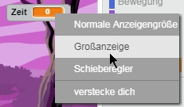

## Eine Uhr hinzufügen

Du kannst das Spiel noch interessanter gestalten, indem Du dem Spieler nur 10 Sekunden Zeit gibst, um so viele Gespenster wie möglich zu fangen.

+ Du kannst eine weitere Variable benutzen, um die verbleibende Zeit anzeigen zu lassen. Klicke auf 'Daten' und erstelle eine neue Variable, die 'Zeit' heißt:

	

+ So sollte die Zeitanzeige funktionieren:

	+ Die Zeit sollte bei 10 Sekunden starten;
	+ Die Uhr sollte jede Sekunde runterrechnen;
	+ Die Uhr sollte bei 0 stoppen.

	Das ist der Code, den Du zu Deiner __Bühne__ hinzufügen kannst:

	```blocks
		Wenn die grüne Flagge angeklickt
		setze [Zeit v] auf [10]
		wiederhole bis <(Zeit) = [0]>
			warte (1) Sek.
			ändere [Zeit v] um (-1)
		Ende
		stoppe [alles v]
	```

	So fügst Du den Code `wiederhole bis`{.blockcontrol}`Zeit`{.blockdata}`= 0`{.blockoperators} hinzu:

	

+ Ziehe Deine 'Zeit'-Variable auf die rechte Seite der Bühne. Mit einem Rechtsklick kannst Du die Darstellung der Zeitvariable verändern.

	

+ Bitte Deine Familie oder Freunde, das Spiel zu testen. Wie viele Punkte können Sie erreichen? Wenn das Spiel zu einfach ist, kannst Du:

	+ Dem Spieler weniger Zeit geben;
	+ Das Gespenst seltener auftauchen lassen;
	+ Das Gespenst kleiner machen.

	Teste Dein Spiel einige Male, bis Du mit dem Schwierigkeitsgrad zufrieden bist.
