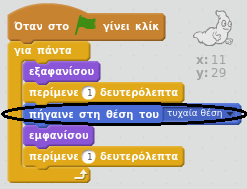

## Τυχαία φαντάσματα

Μέχρι στιγμής, το φάντασμά σου είναι πολύ εύκολο να πιαστεί γιατί δεν κινείται!

\--- task --

Μπορείς να προσθέσεις κώδικα στο φάντασμά σου έτσι ώστε, αντί να μένει στην ίδια θέση, να εμφανίζεται σε τυχαίες θέσεις στην οθόνη;

\--- hints \--- \--- hint \--- Tο φάντασμά σου θέλεις να `πηγαίνει σε`{:class=”blockmotion”} μια τυχαία θέση στο σκηνικό πριν εμφανιστεί κάθε φορά. \--- /hint \--- \--- hint \--- Υπάρχουν δύο ομάδες μπλοκ κώδικα που μπορείς να χρησιμοποιήσεις. Αυτό:  Ή αυτό:  \--- /hint \--- \--- hint \--- Ο κώδικάς σου θα πρέπει να φαίνεται ως εξής:  Ή μπορεί να μοιάζει έτσι:  \--- /hint \--- - - /hints \---

\--- /task \---

\--- challenge \---

## Πρόκληση: περισσότερη τυχαιότητα

Μπορείς να κάνεις το φάντασμα `να περιμένει`{:class=”blockcontrol”} ένα τυχαίο χρονικό διάστημα πριν εμφανιστεί; Μπορείς να χρησιμοποιήσεις το μπλοκ `όρισε το μέγεθος του αντικειμένου`{:class=”blocklooks”} για να έχει το φάντασμα τυχαίο μέγεθος κάθε φορά που εμφανίζεται; \--- /challenge \---