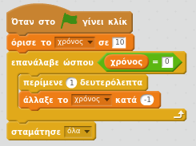

## Προσθέτοντας ένα χρονόμετρο

\--- task --

Δημιούργησε μία νέα μεταβλητή που ονομάζεται 'χρόνος'.

\--- /task \---

\--- task --

Μπορείς να προσθέσεις ένα χρονόμετρο στο Σκηνικό σου για να δώσεις στον παίκτη σου μόνο 10 δευτερόλεπτα για να πιάσει όσα περισσότερα φαντάσματα είναι δυνατόν;

Το χρονόμετρό σου πρέπει να:

+ Ξεκινά από τα 10 δευτερόλεπτα
+ Μετρά κάθε δευτερόλεπτο

Το παιχνίδι πρέπει να σταματά όταν το χρονόμετρο φτάσει στο 0.

\--- hints \--- \--- hint \--- `Όταν πατηθεί η πράσινη σημαία`{:class=”blockevents”}, η μεταβλητή σου `χρόνος`{:class=”blockdata”} πρέπει να `οριστεί σε 10`{:class=”blockdata”}. Στη συνέχεια πρέπει να `αλλάζει κατά -1`{:class="blockdata"} κάθε δευτερόλεπτο `έως ότου φτάσει στο 0`{:class="blockcontrol"}. \--- /hint \--- \--- hint \--- Εδώ είναι τα μπλοκ κώδικα που θα χρειαστείς:  \--- /hint \--- \--- hint \--- Να πως θα προσθέσεις το χρονόμετρο στο παιχνίδι σου: 

Και να πως θα δημιουργήσεις το μπλοκ `χρόνος = 0`:  \--- /hint \--- \--- /hints \---

\--- /task \---

\--- task --

Ζήτησε από έναν φίλο να δοκιμάσει το παιχνίδι σου. Πόσους πόντους μπορεί να κερδίσει;

\--- /task \---

Αν το παιχνίδι σου είναι πολύ εύκολο, μπορείς να:

+ Δώσεις στον παίκτη λιγότερο χρόνο
+ Κάνεις τα φαντάσματα να εμφανίζονται λιγότερο συχνά
+ Κάνεις τα φαντάσματα μικρότερα

\--- task --

Άλλαξε και δοκίμασε το παιχνίδι σου μερικές φορές μέχρι να είσαι ευχαριστημένος ότι είναι το σωστό επίπεδο δυσκολίας.

\--- /task \---