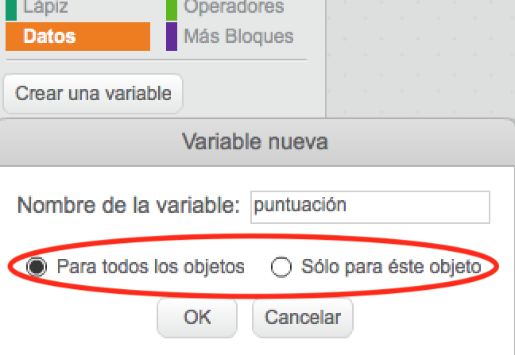
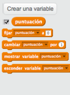
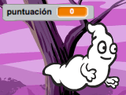

## Añadir puntuación

Vamos a hacer las cosas más interesantes con un contador de puntos.

+ Para contar la puntuación del jugador, necesitas un sitio donde ponerla. Una __variable__ es un sitio para almacenar información que cambia, como la puntuación.

	Para crear una nueva variable, haz clic en la pestaña “Programas”, selecciona `Datos` {.blockdata} y a continuación haz clic en “Crear una Variable”.

	

	Llama a la nueva variable “puntuación”. Asegúrate de que esté disponible para todos los objetos, y haz clic en “OK” para crearla. A continuación verás nuevos bloques de código que pueden usarse con tu variable `puntuación` {.blockdata}.

	

	También verás la puntuación en la parte superior izquierda del escenario.

	

+ Cuando empieza un nuevo juego (haciendo clic en la bandera), deberías hacer que la puntuación del jugador sea 0:

	```blocks
	al presionar bandera verde
	fijar [puntuación v] a [0]
	```

+ Cuando el jugador atrape un fantasma, tendrás que añadir 1 su puntuación:

	

+ Ejecuta tu programa de nuevo y atrapa algunos fantasmas. ¿Cambia tu puntuación?
