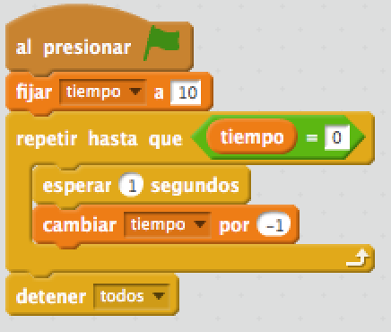

## Añadir un temporizador

\--- task \---

Crea una nueva variable llamada 'tiempo'.

\--- /task \---

\--- task \---

¿Puedes añadir un temporizador a tu escenario para darle a tu jugador solo 10 segundos para atrapar tantos fantasmas como sea posible?

Tu temporizador debería:

+ Comenzar en 10 segundos
+ Contar para atrás cada segundo

El juego debería detenerse cuando el temporizador llegue a 0.

\--- hints \--- \--- hint \--- `Cuando hagas clic en la bandera verde`{:class=”blockevents”}, tu variable `tiempo`{:class=”blockdata”} debería `ponerse a 10`{:class=”blockdata”}. Después se debería `cambiar por -1`{:class=”blockdata”} cada segundo `hasta que llegue a 0`{:class=”blockcontrol"}. \--- /hint \--- \--- hint \--- Aquí tienes los bloques de código que tendrás que usar:  \--- /hint \--- \--- hint \--- Así añades el temporizador a tu juego: 

Y así se crea el bloque para `tiempo = 0`:  \--- /hint \--- \--- /hints \---

\--- /task \---

\--- task \---

Pídele a un/a amigo/a que pruebe tu juego. ¿Cuántos puntos puede conseguir?

\--- /task \---

Si tu juego es demasiado fácil, puedes:

+ Darle menos tiempo al jugador
+ Hacer que los fantasmas aparezcan con menos frecuencia
+ Hacer los fantasmas más pequeños

\--- task \---

Modifica y prueba tu juego varias veces hasta que creas que tiene el nivel de dificultad adecuado.

\--- /task \---