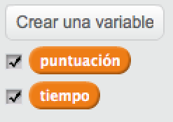
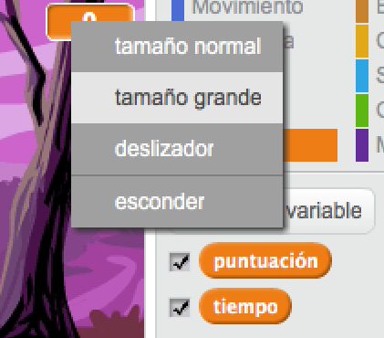

## Añadir un cronómetro

Puedes hacer que tu juego sea más interesante dándole al jugador sólo 10 segundos para que atrape tantos fantasmas como le sea posible.

+ Puedes usar otra variable para mostrar el tiempo que queda. Haz clic en el escenario y crea una nueva variable que se llame “tiempo”:

	

+ Así es como debería de funcionar el cronómetro:

	+ El cronómetro debería de empezar en 10 segundos;
	+ El cronómetro debería de contar hacia atrás cada segundo;
	+ El juego debería de parar cuando el cronómetro llegue a 0.

	Éste es el código para hacerlo, y que puedes añadir a tu __escenario__:

	```blocks
		al presionar bandera verde
		fijar [tiempo v] a [10]
		repetir hasta que <(tiempo) = [0]>
			esperar (1) segundos
			cambiar [tiempo v] por (-1)
		fin
		detener [todos v]
	```

	Así es como se añade el código `repetir hasta`{:class="blockcontrol"}`tiempo`{:class="blockdata"}`= 0`{:class="blockoperators"}:

	

+ Arrastra el visor de la variable “tiempo” al lado derecho del escenario. También puedes hacer clic con el botón derecho en el visor de la variable y elegir "tamaño grande” para cambiar el modo en el que se muestra el tiempo.

	

+ Pídele a un amigo que pruebe tu juego. ¿Cuántos puntos puede conseguir? Si tu juego es demasiado fácil, puedes:

	+ Darle menos tiempo al jugador;
	+ Hacer que los fantasmas no aparezcan tan a menudo;
	+ Hacer que los fantasmas sean más pequeños.

	Prueba tu juego algunas veces hasta que te parezca que tiene el nivel adecuado de dificultad.
