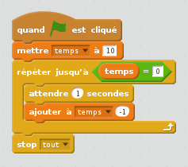

## Ajouter un chronomètre

\--- task \---

Créer une nouvelle variable appelée « temps ».

\--- /task \---

\--- task \---

Peux-tu ajouter un chronomètre à ta scène pour donner ton joueur seulement 10 secondes pour attraper autant de fantômes que possible ?

Ton chronomètre devra :

+ Commencer à 10 secondes
+ Compter à rebours toutes les secondes

Le jeu devrait s'arrêter quand le chronomètre atteindra 0.

\--- hints \--- \--- hint \--- `quand le drapeau vert est cliqué`{:class=”blockevents”}, ta variable `temps`{:class=”blockdata”} doit `être définie sur 10`{:class=”blockdata”}. Il devra alors `ajouter -1`{:class=”blockdata”} chaque seconde `jusqu'à ce qu'il atteigne 0`{:class=”blockcontrol"}. \--- /hint \--- \--- hint \--- Voici les blocs de code dont tu auras besoin:  \--- /hint \--- \--- hint \--- Ton code devrait ressembler à ceci: 

Et voici comment créer le bloc de `temps = 0` :  \--- /hint \--- \--- /hints \---

\--- /task \---

\--- task \---

Demande à un ami de tester ton jeu. Combien de points peuvent-t-il marquer ?

\--- /task \---

Si ton jeu est trop facile, tu peux :

+ Donner au joueur moins de temps
+ Faire apparaître les fantômes moins souvent
+ Rendre les fantômes plus petits

\--- task \---

Change et test ton jeu plusieurs fois jusqu'à ce que tu sois satisfait du niveau de difficulté.

\--- /task \---