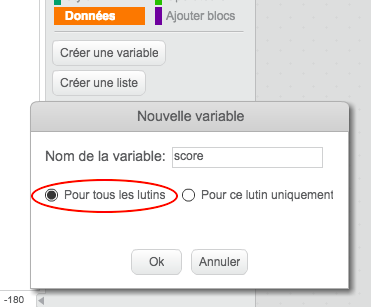
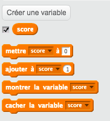

## Ajouter le pointage

Rendons les choses plus intéressantes en gardant le compte du pointage.

+ Pour garder le compte du pointage du joueur, il faut le stocker quelque part. Une __variable__ est un endroit pour garder des données qui peuvent changer, comme un pointage.

	Pour créer une variable, cliquez sur l'onglet 'Scripts', sélectionnez `Données` {.blockdata}, puis cliquez sur 'Créer une variable'.

	

	Tapez 'pointage' comme nom de variable, vérifiez que la variable est disponible pour tous les lutins et cliquez sur 'OK' pour créer la variable. Vous allez ensuite voir plusieurs blocs de code qui peuvent être utilisés avec votre variable `pointage` {.blockdata}.

	

	Vous allez aussi voir le pointage en haut à gauche de la scène.

	

+ Lorsque vous commencez un nouveau jeu (en cliquant sur le drapeau), vous devez remettre le pointage à 0 :

	```blocks
    quand ⚑ cliqué
    [pointage v] prend la valeur [0]
	```

+ Vous devrez ajouter 1 au pointage à chaque fois qu'un fantôme sera attrapé :

	

+ Exécutez votre programme de nouveau et attrapez quelques fantômes. Votre pointage change-t-il?
