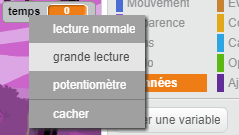

## Ajouter un compte à rebours

Vous pouvez rendre votre jeu encore plus intéressant en limitant chaque partie à 10 secondes pour attraper le plus de fantômes possible.

+ Vous pouvez utiliser une autre variable pour stocker le temps qu'il vous reste. Cliquez sur la scène et créez une nouvelle variable nommée 'temps' :

	

+ Le compte à rebours devrait fonctionner ainsi :

	+ Le compte à rebours devrait commencer à 10 secondes ;
	+ Le compte à rebours devrait décompter chaque seconde ;
	+ Le jeu devrait s'arrêter lorsque le compte à rebours arrive à 0.

	Voici le code qui vous permettra de réaliser cela. Vous pouvez ajouter celui-ci à votre __scène__ :

	```blocks
    	quand le drapeau vert pressé
    	[temps v] prend la valeur [10]
    	répéter jusqu’à <(temps) = [0]>
       		attendre (1) secondes
       		ajouter à [temps v] (-1)
    	fin
    	stop [tout v]
	```

	Voici comment vous pouvez ajouter le code `répéter jusqu’à`{:class="blockcontrol"}`temps`{:class="blockdata"}`= 0`{:class="blockoperators"} :

	

+ Déplacez votre variable 'temps' vers le côté droit de votre scène. Vous pouvez aussi faire un clic droit sur l'affichage de la variable et choisir 'grande lecture' afin de changer la présentation du temps.

	

+ Demandez à un ami de tester votre jeu. Combien de points peut-il marquer? Si votre jeu est trop facile, vous pouvez :

	+ Donner moins de temps au joueur ;
	+ Faire en sorte que les fantômes apparaissent moins souvent ;
	+ Réduire la taille des fantômes.

	Testez votre jeu à quelques reprises jusqu'à ce que vous soyez satisfaits du niveau de difficulté.
