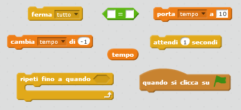
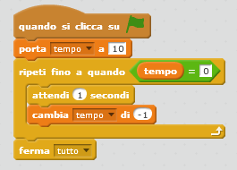

## Aggiungere un timer

\--- task \---

Crea una nuova variabile chiamata 'tempo'.

\--- /task \---

\--- task \---

Puoi aggiungere un timer al tuo sfondo per dare al tuo giocatore solo 10 secondi per catturare quanti più fantasmi possibile?

Il tuo timer dovrebbe:

+ Partire da 10 secondi
+ Contare alla rovescia ogni secondo

Il gioco dovrebbe interrompersi quando il timer raggiunge lo 0.

\--- hints \--- \--- hint \--- `Quando si clicca su ⚑`{:class=”blockevents”}, la tua variabile `tempo`{:class=”blockdata”} dovrebbe `essere pari a 10`{:class=”blockdata”}. Dovrebbe quindi `diminuire di -1`{:class=”blockdata”} ogni secondo, `fino a raggiungere lo 0`{:class=”blockcontrol"}. \--- /hint \--- \--- hint \--- Ecco di quali blocchi di codice avrai bisogno:  \--- /hint \--- \--- hint \--- Ecco come aggiungere un timer al tuo gioco: 

Ecco come creare il blocco `tempo = 0`:  \--- /hint \--- \--- /hints \---

\--- /task \---

\--- task \---

Chiedi a un amico di provare il gioco. Quanti punti riesce a guadagnare?

\--- /task \---

Se il gioco è troppo facile, puoi:

+ Dare al giocatore meno tempo
+ Ridurre la frequenza con cui i fantasmi appaiono
+ Rimpicciolire i fantasmi

\--- task \---

Prova il gioco un paio di volte fino a quando non sei soddisfatto del livello di difficoltà.

\--- /task \---