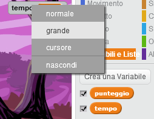

## Aggiungere un timer

Puoi rendere il gioco più interessante, dando solo 10 secondi al tuo giocatore per acchiappare più fantasmi possibili.

+ Puoi usare un'altra variabile per conservare il tempo rimasto. Clicca sul quadro e crea una nuova variabile chiamata 'tempo':

	

+ Il timer dovrebbe funzionare così:

	+ Il timer dovrebbe iniziare a 10 secondi;
	+ Il timer dovrebbe contare alla rovescia ogni secondo;
	+ Il gioco dovrebbe interrompersi quando il timer raggiunge lo 0.

	Per fare ciò, questo è il codice, che puoi aggiungere al tuo __quadro__.

	```blocks
		quando si clicca sulla bandiera verde
		porta [tempo v] a [10]
		ripeti fino a quando <(tempo) = [0]>
  			attendi (1) secondi
  			cambia [ora v] di (-1)
		end
		ferma [tutto v]
	```

	Il codice `ripeti fino a quando`{.blockcontrol}`tempo`{.blockdata}`= 0`{.blockoperators} si aggiunge così:

	

+ Trascina la tua variabile 'tempo' sul lato destro del quadro. Puoi anche fare clic col tasto destro sulla variabile e scegliere 'large readout' per cambiare il modo in cui il tempo viene visualizzato.

	

+ Chiedi a un amico di provare il gioco. Quanti punti riesce a guadagnare? Se il gioco è troppo facile, puoi:

	+ Dare al giocatore meno tempo;
	+ Ridurre la frequenza con cui i fantasmi appaiono;
	+ Rimpicciolire i fantasmi.

	Prova alcune volte il gioco finché sei soddisfatto con il livello di difficoltà.
