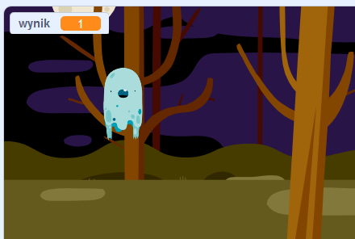

## Dodaj wynik

Teraz sprawisz, że twoja gra będzie bardziej interesująca dzięki zbieraniu punktów!

\--- task \---

Utwórz nową zmienną o nazwie `wynik`{: class = "block3variables"}.

[[[generic-scratch3-add-variable]]]

\--- /task \---

\--- task \---

Czy możesz śledzić wynik gracza? Gracze powinni zdobywać punkty, łapiąc duchy poprzez kliknięcie na nie.

Za każdym razem, gdy gracz kliknie na ducha, jego wynik powinien wzrosnąć.



\--- hints \--- \--- hint \---

`Po kliknięciu zielonej flagi`{: class = "block3events"} twoja zmienna `wynik`{: class = "block3variables"} powinna być `ustawiona na 0`{: class = "block3variables"}. Scena jest najlepszym miejscem do dodania tego kodu.

`Po kliknięciu duszka ducha`{: class = "block3events"}, zmienna `wynik`{: class = "block3variables"} powinna być `zmieniona o 1`{: class = "block3variables"}.

-- /hint \--- \--- hint \---

Here are the code blocks you need:


```blocks3
ustaw [wynik v] na (0)

po kliknięciu flagi
```


```blocks3
zmienić [wynik v] o (1)
```

-- /hint \--- \--- hint \---


```blocks3
kiedy kliknięto zieloną flagę
ustaw [wynik v] na (0)
```


```blocks3
Kiedy duszek kliknięty
ukryj

+ zmień [wynik v] o (1)
```

\--- /hint \--- \--- /hints \---

\--- /task \---